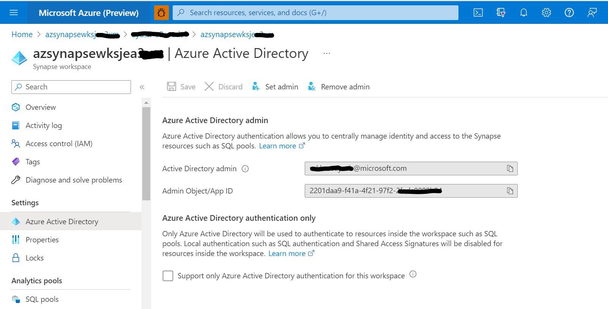
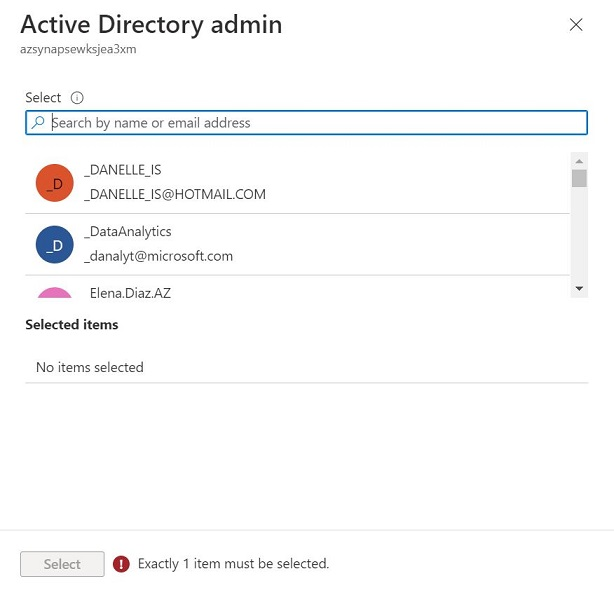
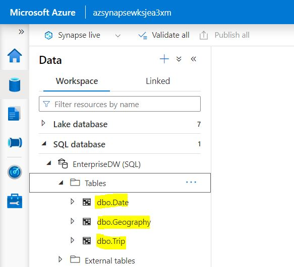
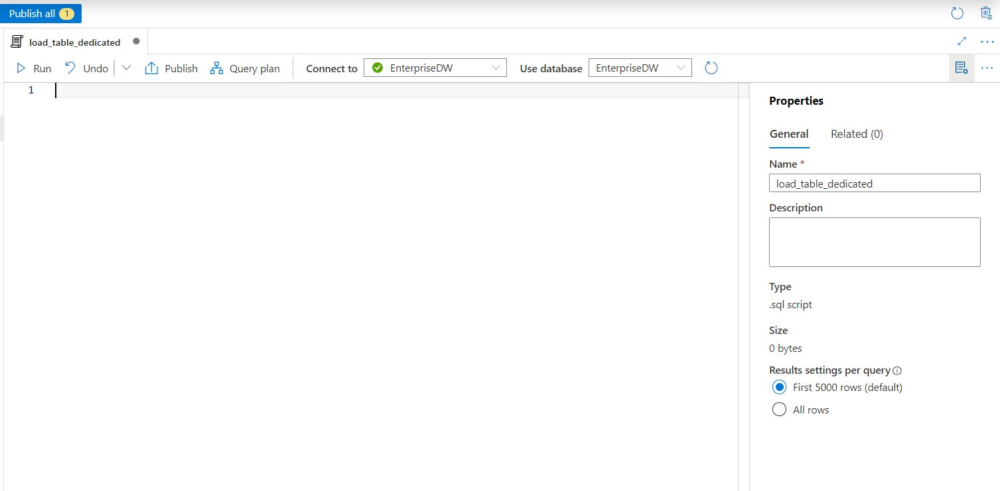
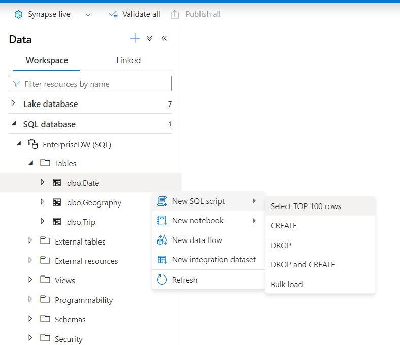
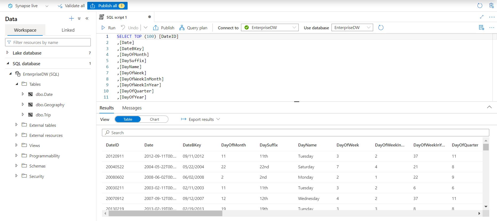

## Description
Dedicated SQL pool stores data in relational tables with columnar storage. This format significantly reduces the data storage costs, and improves query performance. Once data is stored, you can run analytics at massive scale

## Prerequisites
There are two administrative accounts (**SQL admin username** and **SQL Active Directory admin**) that act as administrators.
#### SQL Active Directory admin
One Azure Active Directory account, either an individual or security group account, can also be configured as an administrator. It's optional to configure an Azure AD administrator, but an Azure AD administrator must be configured if you want to use Azure AD accounts to connect to Synapse SQL.
1. The Azure Active Directory admin account controls access to dedicated SQL pools, while Synapse RBAC roles are used to control access to serverless pools, for example, the Synapse Administrator role. Changing the Azure Active Directory administrator account will only affect the account's access to dedicated SQL pools.

  1. Once you open workspace from resource group, click on the **Azure Active Directory** under settings using the left side navigation.
  
     
  
  2. Select **_Set Admin_**.
  
  3. Enter your userId or name or emailID for search and click **Select**.
  
     
  
  4. Click on **_Save_** .

### Steps to generate secret key(will be used in load data Exercise)

   1. In the resource group click on the raw storage account name. Also note down the raw storage account name for further references
   
   2. Select **container** from the left side navigation and click on **Raw**.
   
   3. Select **Shared access tokens** from the left side navigation and click on **Generate SAS token and URL**.
     
   
     
   4. Copy **"Blob SAS token"** which can be used as secret key. for e.g.,
     
   

## Exercise 1

### Steps to create tables using dedicated SQL Pool with different distributions, partitions and indexes

In this section, you will use dedicated SQL Pool to create tables.

## Steps to create script :

1.  In Synapse studio open **_Develop_** from the left side navigation.

2.  Click on  **SQL Script** to open new sql script file.

    

3.  In the properties section rename the script to **_``create_table_dedicated``_** .

4.  Select the **_EnterpriseDW_** from the **_Connect to_** dropdown.

    

## Distributions

### Round-robin distributed
Distributes table rows evenly across all distributions at random.

5.  For creating the **Geography** table using Round-robin distribution run the below query.

``` sql
CREATE TABLE [dbo].[Geography]
(
    [GeographyID] int NOT NULL,
    [ZipCodeBKey] varchar(10) COLLATE SQL_Latin1_General_CP1_CI_AS NOT NULL,
    [County] varchar(50) COLLATE SQL_Latin1_General_CP1_CI_AS NULL,
    [City] varchar(50) COLLATE SQL_Latin1_General_CP1_CI_AS NULL,
    [State] varchar(50) COLLATE SQL_Latin1_General_CP1_CI_AS NULL,
    [Country] varchar(50) COLLATE SQL_Latin1_General_CP1_CI_AS NULL,
    [ZipCode] varchar(50) COLLATE SQL_Latin1_General_CP1_CI_AS NULL
)
WITH
(
    DISTRIBUTION = ROUND_ROBIN,
    CLUSTERED COLUMNSTORE INDEX
);
```
### Hash distributed
Distributes table rows across the Compute nodes by using a deterministic hash function to assign each row to one distribution.

6. For creating the **HackneyLicense** table using Hash distribution run the below query

``` sql
CREATE TABLE [dbo].[HackneyLicense]
(
    [HackneyLicenseID] int NOT NULL,
    [HackneyLicenseBKey] varchar(50) COLLATE SQL_Latin1_General_CP1_CI_AS NOT NULL,
    [HackneyLicenseCode] varchar(50) COLLATE SQL_Latin1_General_CP1_CI_AS NULL
)
WITH
(
    DISTRIBUTION = HASH([HackneyLicenseID]),
    CLUSTERED COLUMNSTORE INDEX
);
```
### Replicated distributed
Full copy of table accessible on each distribution.

7. For creating the **Medallion** table using Replicate distribution run the below query

``` sql
CREATE TABLE [dbo].[Medallion]
(
    [MedallionID] int NOT NULL,
    [MedallionBKey] varchar(50) COLLATE SQL_Latin1_General_CP1_CI_AS NOT NULL,
    [MedallionCode] varchar(50) COLLATE SQL_Latin1_General_CP1_CI_AS NULL
)
WITH
(
    DISTRIBUTION = REPLICATE,
    CLUSTERED COLUMNSTORE INDEX
);
```
## Partitions
Table partitions divide data into smaller groups In most cases, partitions are created on a date column Supported on all table types
#### RANGE RIGHT – Used for time partitions
#### RANGE LEFT – Used for number partitions

8.   For creating the **Date** table using RANGE RIGHT partition run the below query.

``` sql
CREATE TABLE [dbo].[Date]
(
    [DateID] int NOT NULL,
    [Date] datetime NULL,
    [DateBKey] char(10) COLLATE SQL_Latin1_General_CP1_CI_AS NULL,
    [DayOfMonth] varchar(2) COLLATE SQL_Latin1_General_CP1_CI_AS NULL,
    [DaySuffix] varchar(4) COLLATE SQL_Latin1_General_CP1_CI_AS NULL,
    [DayName] varchar(9) COLLATE SQL_Latin1_General_CP1_CI_AS NULL,
    [DayOfWeek] char(1) COLLATE SQL_Latin1_General_CP1_CI_AS NULL,
    [DayOfWeekInMonth] varchar(2) COLLATE SQL_Latin1_General_CP1_CI_AS NULL,
    [DayOfWeekInYear] varchar(2) COLLATE SQL_Latin1_General_CP1_CI_AS NULL,
    [DayOfQuarter] varchar(3) COLLATE SQL_Latin1_General_CP1_CI_AS NULL,
    [DayOfYear] varchar(3) COLLATE SQL_Latin1_General_CP1_CI_AS NULL,
    [WeekOfMonth] varchar(1) COLLATE SQL_Latin1_General_CP1_CI_AS NULL,
    [WeekOfQuarter] varchar(2) COLLATE SQL_Latin1_General_CP1_CI_AS NULL,
    [WeekOfYear] varchar(2) COLLATE SQL_Latin1_General_CP1_CI_AS NULL,
    [Month] varchar(2) COLLATE SQL_Latin1_General_CP1_CI_AS NULL,
    [MonthName] varchar(9) COLLATE SQL_Latin1_General_CP1_CI_AS NULL,
    [MonthOfQuarter] varchar(2) COLLATE SQL_Latin1_General_CP1_CI_AS NULL,
    [Quarter] char(1) COLLATE SQL_Latin1_General_CP1_CI_AS NULL,
    [QuarterName] varchar(9) COLLATE SQL_Latin1_General_CP1_CI_AS NULL,
    [Year] char(4) COLLATE SQL_Latin1_General_CP1_CI_AS NULL,
    [YearName] char(7) COLLATE SQL_Latin1_General_CP1_CI_AS NULL,
    [MonthYear] char(10) COLLATE SQL_Latin1_General_CP1_CI_AS NULL,
    [MMYYYY] char(6) COLLATE SQL_Latin1_General_CP1_CI_AS NULL,
    [FirstDayOfMonth] date NULL,
    [LastDayOfMonth] date NULL,
    [FirstDayOfQuarter] date NULL,
    [LastDayOfQuarter] date NULL,
    [FirstDayOfYear] date NULL,
    [LastDayOfYear] date NULL,
    [IsHolidayUSA] bit NULL,
    [IsWeekday] bit NULL,
    [HolidayUSA] varchar(50) COLLATE SQL_Latin1_General_CP1_CI_AS NULL
)
WITH
(
    DISTRIBUTION = ROUND_ROBIN,
    CLUSTERED COLUMNSTORE INDEX,
    PARTITION (
[Date] RANGE RIGHT FOR VALUES (
'2000-01-01', '2001-01-01', '2002-01-01',
'2003-01-01', '2004-01-01', '2005-01-01',
'2006-01-01', '2007-01-01', '2008-01-01',
'2009-01-01', '2010-01-01', '2011-01-01',
'2012-01-01', '2013-01-01', '2014-01-01',
'2015-01-01'
)
)
);

  ```
## Indexes
### Clustered Columnstore index (Default Primary)
Highest level of data compression and Best overall query performance. 
### Nonclustered indexes (Secondary)
Enable ordering of multiple columns in a table, Allows multiple nonclustered on a single table, Can be created on any of the above primary indexes,
More performant lookup queries

9. For creating the **Time** table using Clustered Columnstore index and Nonclustered indexes run the below query

``` sql
CREATE TABLE [dbo].[Time]
(
    [TimeID] int NOT NULL,
    [TimeBKey] varchar(8) COLLATE SQL_Latin1_General_CP1_CI_AS NOT NULL,
    [HourNumber] tinyint NOT NULL,
    [MinuteNumber] tinyint NOT NULL,
    [SecondNumber] tinyint NOT NULL,
    [TimeInSecond] int NOT NULL,
    [HourlyBucket] varchar(15) COLLATE SQL_Latin1_General_CP1_CI_AS NOT NULL,
    [DayTimeBucketGroupKey] int NOT NULL,
    [DayTimeBucket] varchar(100) COLLATE SQL_Latin1_General_CP1_CI_AS NOT NULL
)
WITH
(
    DISTRIBUTION = ROUND_ROBIN,
    CLUSTERED COLUMNSTORE INDEX
);

CREATE INDEX HourNumberIndex ON Time(HourNumber);
```
### Clustered index (Primary)
Performant for looking up a single to few rows

10. For creating the **Trip** table using clustered index run the below query

``` sql
CREATE TABLE [dbo].[Trip]
(
    [DateID] int NOT NULL,
    [MedallionID] int NOT NULL,
    [HackneyLicenseID] int NOT NULL,
    [PickupTimeID] int NOT NULL,
    [DropoffTimeID] int NOT NULL,
    [PickupGeographyID] int NULL,
    [DropoffGeographyID] int NULL,
    [PickupLatitude] float NULL,
    [PickupLongitude] float NULL,
    [PickupLatLong] varchar(50) COLLATE SQL_Latin1_General_CP1_CI_AS NULL,
    [DropoffLatitude] float NULL,
    [DropoffLongitude] float NULL,
    [DropoffLatLong] varchar(50) COLLATE SQL_Latin1_General_CP1_CI_AS NULL,
    [PassengerCount] int NULL,
    [TripDurationSeconds] int NULL,
    [TripDistanceMiles] float NULL,
    [PaymentType] varchar(50) COLLATE SQL_Latin1_General_CP1_CI_AS NULL,
    [FareAmount] money NULL,
    [SurchargeAmount] money NULL,
    [TaxAmount] money NULL,
    [TipAmount] money NULL,
    [TollsAmount] money NULL,
    [TotalAmount] money NULL
)
WITH
(
    DISTRIBUTION = ROUND_ROBIN,
    CLUSTERED INDEX (MedallionID)
);
```
### Heap (Primary)
Faster loading and landing temporary data and Best for small lookup tables

11. For creating the **Weather** table using Heap run the below query

``` sql
CREATE TABLE [dbo].[Weather]
(
    [DateID] int NOT NULL,
    [GeographyID] int NOT NULL,
    [PrecipitationInches] float NOT NULL,
    [AvgTemperatureFahrenheit] float NOT NULL
)
WITH
(
    DISTRIBUTION = ROUND_ROBIN,
    HEAP
);
```
12. Publish the script for future references. 


## Validate Tables Created

1. In Workspace open **_Data_** from the left side navigation
2. Expand **SQL database**
3. Expand **EnterpriseDW (SQL)** (Refresh EnterpriseDW (SQL))
4. Expand **Tables**
5. Check the tables created.

  

## Distributed table design recommendations

### Hash Distribution
Large fact tables exceeding several GBs with frequent inserts should use a hash distribution.

### Round Robin Distribution
Potentially useful tables created from raw input and Temporary staging tables used in data preparation.

### Replicated Tables
Lookup tables that range in size from 100’s MBs to 1.5 GBs should be replicated. Works best when table size is less than 2 GB compressed.

## Choosing the right index
1. Clustered Columnstore indexes (CCI) are best for fact tables.
2. CCI offer the highest level of data compression and best query performance for tables with over 100 million rows.
3. Heap tables are best for small lookup tables and recommended for tables with less than 100 million rows.
4. Clustered Indexes may outperform CCI when very few rows need to be retrieved quickly.
5. Add non-clustered indexes to improve performance for less selective queries
6. Each additional index added to a table increases storage space required and processing time during data loads.
7. Speed load performance by staging data in heap tables and temporary tables prior to running transformations.

# SQL Script to load data using dedicated SQL Pool

In this section, you will use dedicated SQL Pool to load tables using the files stored in the ADLS Gen2 storage by **COPY** Command which Copies data from source to destination

### Benefits
1. Retrieves data from all files from the folder and all its subfolders. 
2. Supports multiple locations from the same storage account, separated by comma
3. Supports Azure Data Lake Storage (ADLS) Gen 2 and Azure Blob Storage. 
4. Supports CSV, PARQUET, ORC file formats 

## Exercise 2

### Steps to load data by COPY INTO command using dedicated SQL Pool:

1.  In Workspace open **_Develop_** from the left side navigation.

2.  Click on  **SQL Script** to open new sql script file.

  

3.  In the properties section rename the script to **_``load_table_dedicated``_**.

4.  Select the **EnterpriseDW** from the Connect to dropdown.

  

5.  Replace the **azrawStorageAccount** placeholder with the **_``Raw storage account``_** name before running the below sql script. (ref prerequisite section)
6.  Replace **SAS SECRET KEY** placeholder with **"Blob SAS token"** (ref prerequisite section)
7.  For loading the **Date** table run the below query.

``` sql
COPY INTO [dbo].[Date]
FROM 'https://<azrawStorageAccount>.dfs.core.windows.net/raw/date.csv'
WITH
(
    FILE_TYPE = 'CSV',
	FIELDTERMINATOR = ',',
	FIELDQUOTE = '',
    CREDENTIAL=(IDENTITY= 'Shared Access Signature', SECRET='<SAS SECRET KEY>')
)
OPTION (LABEL = 'COPY : Load [dbo].[Date] - Taxi dataset');

```

8.  For creating the **Geography** table run the below query.

``` sql
COPY INTO [dbo].[Geography]
FROM 'https://<azrawStorageAccount>.dfs.core.windows.net/raw/Geography.csv'
WITH
(
    FILE_TYPE = 'CSV',
	FIELDTERMINATOR = ',',
	FIELDQUOTE = '',
    CREDENTIAL=(IDENTITY= 'Shared Access Signature', SECRET='<SAS SECRET KEY>')
)
OPTION (LABEL = 'COPY : Load [dbo].[Geography] - Taxi dataset');
```

9. For creating the **HackneyLicense** table run the below query.

``` sql
COPY INTO [dbo].[HackneyLicense]
FROM 'https://<azrawStorageAccount>.dfs.core.windows.net/raw/HackneyLicense.csv'
WITH
(
    FILE_TYPE = 'CSV',
	FIELDTERMINATOR = ',',
	FIELDQUOTE = '',
    CREDENTIAL=(IDENTITY= 'Shared Access Signature', SECRET='<SAS SECRET KEY>')
)
OPTION (LABEL = 'COPY : Load [dbo].[HackneyLicense] - Taxi dataset');
```

10. For creating the **Medallion** table run the below query.

``` sql
COPY INTO [dbo].[Medallion]
FROM 'https://<azrawStorageAccount>.dfs.core.windows.net/raw/Medallion.csv'
WITH
(
    FILE_TYPE = 'CSV',
	FIELDTERMINATOR = ',',
	FIELDQUOTE = '',
    CREDENTIAL=(IDENTITY= 'Shared Access Signature', SECRET='<SAS SECRET KEY>')
)
OPTION (LABEL = 'COPY : Load [dbo].[Medallion] - Taxi dataset');
```
11. For creating the **Time** table run the below query.

``` sql
COPY INTO [dbo].[Time]
FROM 'https://<azrawStorageAccount>.dfs.core.windows.net/raw/Time.csv'
WITH
(
    FILE_TYPE = 'CSV',
	FIELDTERMINATOR = ',',
	FIELDQUOTE = '',
    CREDENTIAL=(IDENTITY= 'Shared Access Signature', SECRET='<SAS SECRET KEY>')
)
OPTION (LABEL = 'COPY : Load [dbo].[Time] - Taxi dataset');
```

12. For creating the **Trip** table run the below query.

``` sql
COPY INTO [dbo].[Trip]
FROM 'https://<azrawStorageAccount>.dfs.core.windows.net/raw/Trip.csv'
WITH
(
   FILE_TYPE = 'CSV',
	FIELDTERMINATOR = ',',
	FIELDQUOTE = '',
    CREDENTIAL=(IDENTITY= 'Shared Access Signature', SECRET='<SAS SECRET KEY>')
)
OPTION (LABEL = 'COPY : Load [dbo].[Trip] - Taxi dataset');
```

13. For creating the **Weather** table run the below query.

``` sql
COPY INTO [dbo].[Weather]
FROM 'https://<azrawStorageAccount>.dfs.core.windows.net/raw/Weather.csv'
WITH
(
    FILE_TYPE = 'CSV',
	FIELDTERMINATOR = ',',
	FIELDQUOTE = '',
    CREDENTIAL=(IDENTITY= 'Shared Access Signature', SECRET='<SAS SECRET KEY>')
	
)
OPTION (LABEL = 'COPY : Load [dbo].[Weather] - Taxi dataset');
```
14. Publish the script for future reference.
 
## Validate loading data

1. In Workspace open **Data** from the left side navigation.
2. Expand **SQL database**.
3. Expand **EnterpriseDW (SQL)**. (Refresh EnterpriseDW (SQL))
4. Expand **Tables**.
5. Right click on any table then select **New SQL Script > Select TOP 100 Rows**.

   

7. Run the script to check the data loaded in the table.

   
   


