# Analyze data using serverless pools

## Prerequisites:
### Log-in to the Azure Portal
1. In a new window, sign in to the **Azure Portal** (<https://portal.azure.com>).

2.  In the **Resource groups** blade, navigate to created resource group and select the created  **Synapse Workspace**.

   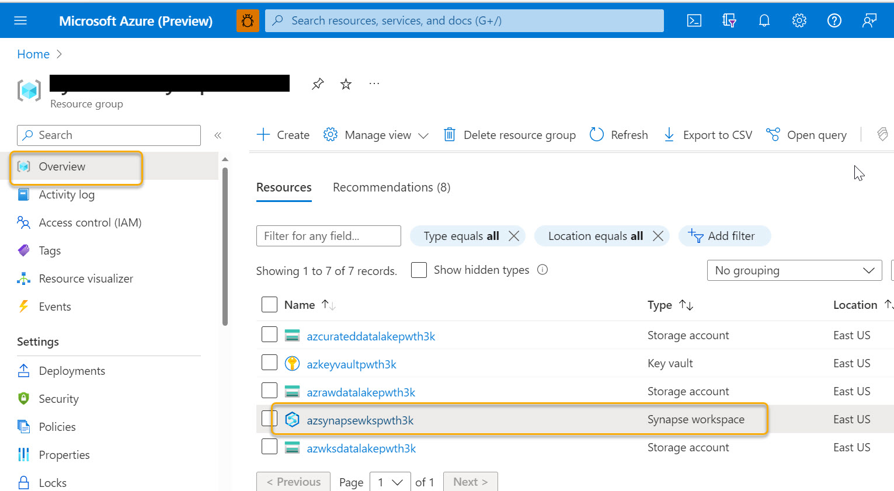  
   
3. In the  **_Overview_** section of synapseworkspace select **_Open_** to open synapse studio.

  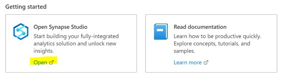

### Note : Synapse Administrator access is already provided and below two steps are only for the learning and knowledge purpose

1. If you dont have the Synapse Administrator access then synapse workspace will promt **Failed to load** message.

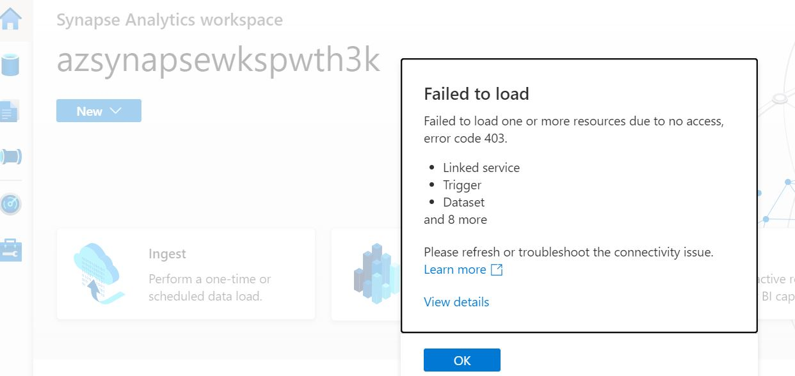
    
2.	To provide Synapse Administrator access In Synapse Studio, under  **_Manage_** tab, select **_Access Control_** and add yourself as the **_Synapse Administrator_**

    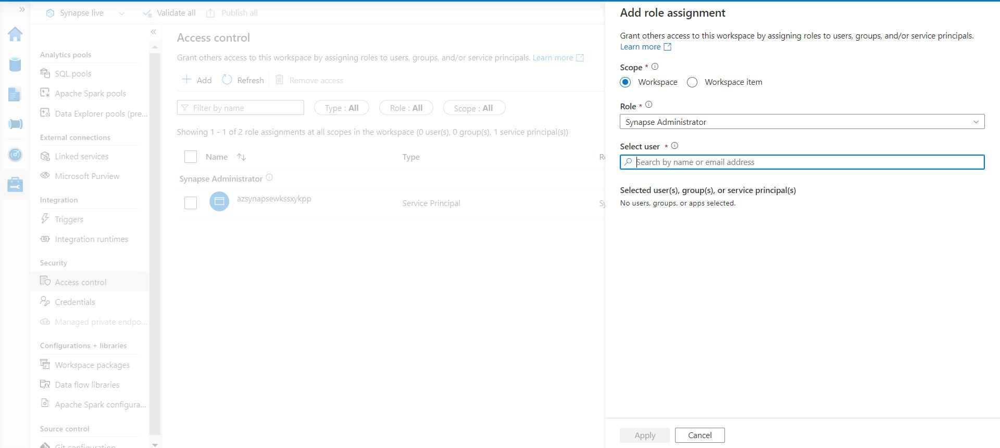
    
### Steps to generate SAS token(will be used in Exercise later)
   
   1. In the resource group click on the raw storage account name. Also note down the raw storage account name for further references
   
   2. Select **container** from the left side navigation and click on **Raw**.
   
   3. Select **Shared access tokens** from the left side navigation and click on **Generate SAS token and URL**.
     
   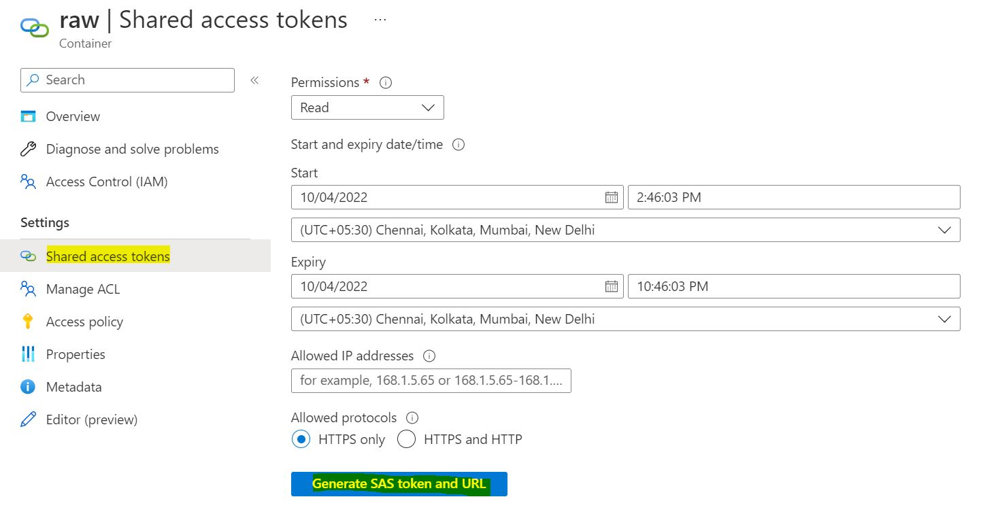
     
   4. Copy **"Blob SAS token"** which can be used as secret key. for e.g.,
     
   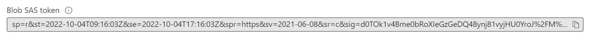

## Exercise 1 : Create Logical Data Warehouse with serverless SQL pool

In this tutorial, you will learn how to create a Logical Data Warehouse (LDW) on top of Azure storage

LDW is a relational layer built on top of Azure data sources such as Azure Data Lake storage (ADLS), Azure Cosmos DB analytical storage, or Azure Blob storage.

### Data Flow

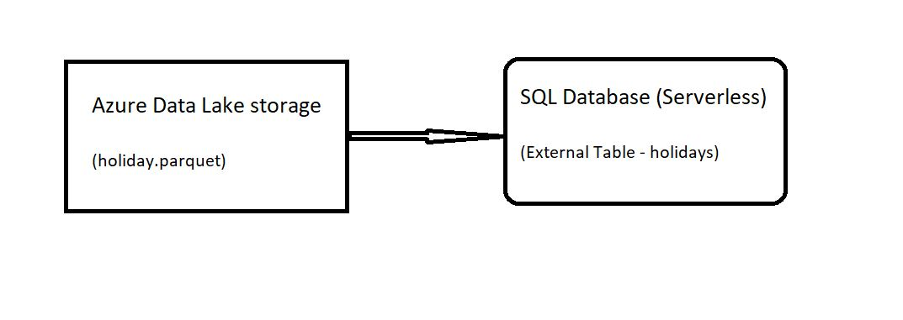

1. After opening Synapse Studio, navigate to **_Develop_** menu at left side, then select the **"+"** icon and choose SQL script.
     
     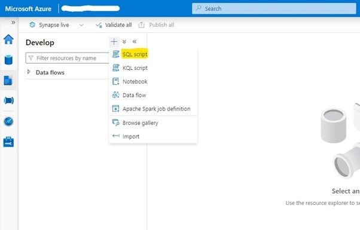
     
2. Choose the specific serverless SQL pool(built-in) from the Connect to drop-down menu.

3. In the properties section on the right pane renaming the script as  ``sql_create_external_table``

4. Copy and paste the snippet on the place given below in SQL Scripts section

### Create an LDW database

You need to create a custom database where you will store your external tables and views that are referencing external data sources.

```sql
CREATE DATABASE Ldw
      COLLATE Latin1_General_100_BIN2_UTF8;
```
This collation will provide the optimal performance while reading Parquet and Cosmos DB. If you don't want to specify the database collation, make sure that you specify this collation in the column definition.

5. Select the Run button to execute your SQL script and observe the results.
     
     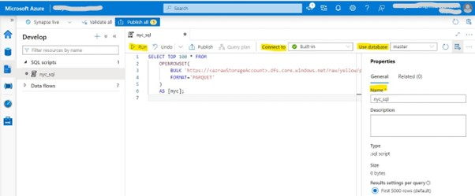

### Configure data sources and formats

As a prerequisite, you will need to create a master key in the database:

change database to **Lwd** before executing below scripts.

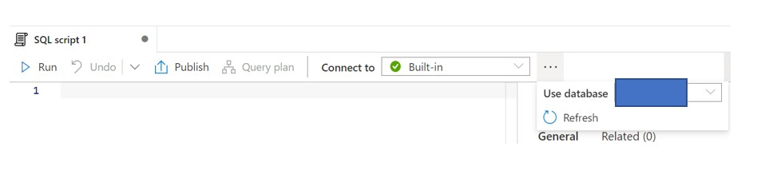

```sql
CREATE MASTER KEY ENCRYPTION BY PASSWORD = 'Password@123';
 ```

1. You need to configure data source and specify file format of remotely stored data, this will require to create a SCOPED CREDENTIAL

     Replace <secret-key> place holder with secret key generated above (ref prerequisite section)

     ```sql
     CREATE DATABASE SCOPED CREDENTIAL scpCred
     WITH IDENTITY = 'SHARED ACCESS SIGNATURE',
          SECRET = '<secret-key>';
     ```

2. External file formats define the structure of the files stored on external data source.
     
     ```sql
     CREATE EXTERNAL FILE FORMAT ParquetFormat WITH (  FORMAT_TYPE = PARQUET );
     GO
     CREATE EXTERNAL FILE FORMAT CsvFormat WITH (  FORMAT_TYPE = DELIMITEDTEXT );
     ```

3. Create data source
Data sources represent connection string information that describes where your data is placed and how to authenticate to your data source.
Replace <rawstorageaccountName> place holder with the Raw strorage account name. (ref prerequisite section)
     
     ```sql
     CREATE EXTERNAL DATA SOURCE holiday_data WITH (
         LOCATION = 'https://<rawstorageaccountName>.blob.core.windows.net/raw/',
         CREDENTIAL = scpCred
     );
     ```
### Explore your data

Once you set up your data sources, you can use the OPENROWSET function to explore your data. The OPENROWSET function reads content of a remote data source (for example file) and returns the content as a set of rows.

```sql
select top 10  *
from openrowset(bulk 'holiday.parquet',
                data_source = 'holiday_data',
               
                format='parquet') as a
```

### Create external tables on Azure storage

Once you discover the schema, you can create external tables and views on top of your external data sources. The good practice is to organize your tables and views in databases schemas. In the following query you can create a schema where you will place all objects that are accessing Holiday data set in Azure data Lake storage:

```sql
create schema holiday_adls;
```

The database schemas are useful for grouping the objects and defining permissions per schema.

Once you define the schemas, you can create external tables that are referencing the files. The following external table is referencing the Holiday parquet file placed in the Azure storage:

```sql
create external table holiday_adls.holiday (
    countryOrRegion          varchar(256),
    holidayName              varchar(256),
    normalizeHolidayName     varchar(256),
    isPaidTimeOff            varchar(256),
    countryRegionCode        varchar(16),
    date                     date
    
) with (
    data_source= holiday_data,
    location = 'holiday.parquet',
    file_format = ParquetFormat
);   
```
### Validate External Table created

1. Goto Data Tab --> Workspace --> SQL database (Refresh SQL databases)
2. Expand Ldw Database
3. Expand External tables
4. Check for **holiday_adls.holiday**    
5. Right click on **holiday_adls.holiday** and Select Top 100 rows      

    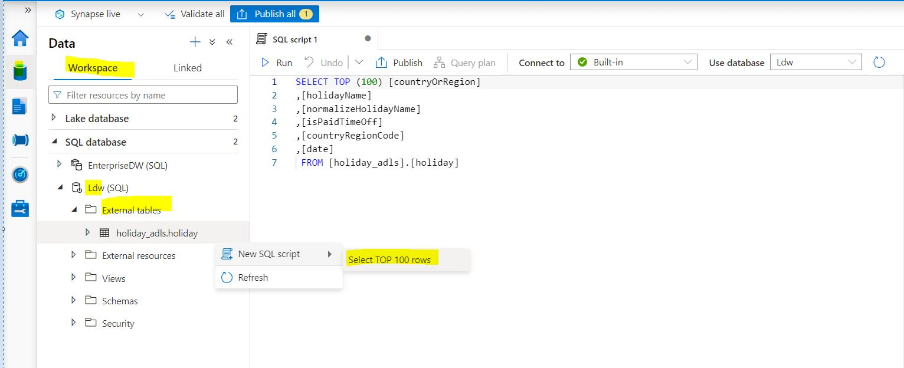 

## Exercise 2 : SQL Script to run query using Serverless SQL Pool

### Authoring SQL Script and Run the SQL script:

1.	Again, navigate to **_Develop_** menu at left side, then select the **"+"** icon and choose SQL script.
     
     

2.	Choose the specific serverless SQL pool(built-in) from the Connect to drop-down menu. Or  if necessary, database can be selected.

3.	In the properties section on the right pane renaming the script as  ``nyc_sql``
   
4.	Copy and paste the snippet on the place given below in SQL Scripts section

5. Replace the **rawstorageaccountName** placeholder with the **_``Raw storage account``_** name before running the below sql script. (ref prerequisite section)

6.	Select the Run button to execute your SQL script and observe the results.
     
     
 
 **SQL Scripts**
 
 i. This query fetches top 100 records present in the mentioned path from azraw-storage_account.
   
```sql

SELECT TOP 100 * FROM
    OPENROWSET(
        BULK 'https://<rawstorageaccountName>.dfs.core.windows.net/raw/yellow/puYear=*/puMonth=*/*.parquet',
        FORMAT='PARQUET'
    )
    AS [nyc];
```

ii. This query will fetch number of rides per every year in increasing order.

```sql

SELECT
    YEAR(tpepPickupDateTime) AS current_year,
    COUNT(*) AS rides_per_year
FROM
    OPENROWSET(
        BULK 'https://<rawstorageaccountName>.dfs.core.windows.net/raw/yellow/puYear=*/puMonth=*/*.parquet',
        FORMAT='PARQUET'
    ) AS [nyc]
WHERE nyc.filepath(1) >= '2009' AND nyc.filepath(1) <= '2022'
GROUP BY YEAR(tpepPickupDateTime)
ORDER BY 1 ASC;
```

iii. This query will fetch number of rides every day in date format with increasing order.

   ```sql

SELECT
    CAST([tpepPickupDateTime] AS DATE) AS [current_day],
    COUNT(*) as rides_per_day
FROM
    OPENROWSET(
        BULK 'https://<rawstorageaccountName>.dfs.core.windows.net/raw/yellow/puYear=*/puMonth=*/*.parquet',
        FORMAT='PARQUET'
    ) AS [nyc]
WHERE nyc.filepath(1) = '2022'
GROUP BY CAST([tpepPickupDateTime] AS DATE)
ORDER BY 1 ASC;
  ```
### Publishing the SQL Script

Once executing all the code cells. Click **_Validate All_** and **_Publish All_** at the top.

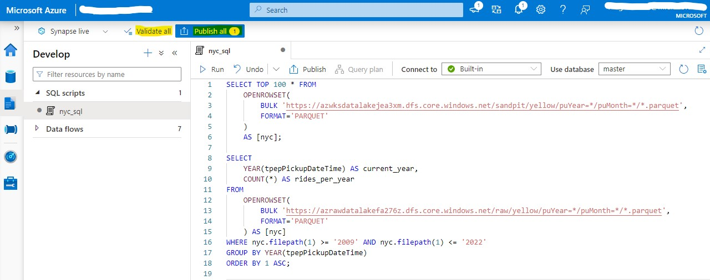
